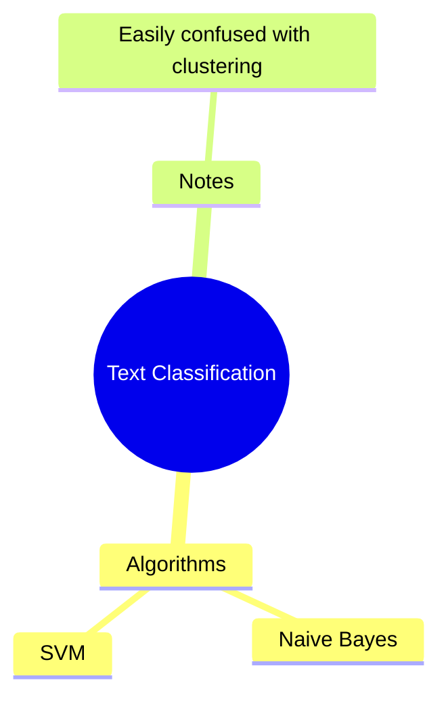

# Chế Độ Render - Render Modes

## Tổng Quan

Cùng một nguồn Mermaid có thể được render khác nhau tùy **chế độ** (mode).
Chế độ xác định **mục đích sử dụng** và ảnh hưởng đến style trực quan.

---

## A. Brainstorm Mode (Chế Độ Tư Duy)

### Mục Tiêu

- **Mở rộng ý tưởng** nhanh chóng
- Không phân tâm vào hình thức
- Tập trung vào **số lượng** ý tưởng

### Đặc Điểm Render

| Thuộc tính | Giá trị               |
| ---------- | --------------------- |
| Hộp        | Chỉ Root              |
| Đường kẻ   | Chiếm ưu thế          |
| Màu sắc    | Đơn giản, ít contrast |
| Font size  | Đồng đều hơn          |
| Animation  | Nhanh, không chú ý    |

### Style Mapping

```javascript
const BRAINSTORM_OVERRIDES = {
  Root: {
    hasBox: true,
    // Giữ nguyên
  },
  Concept: {
    hasBox: false, // ← Khác Study!
    fontWeight: "medium",
    // Chỉ in đậm nhẹ, không hộp
  },
  Idea: {
    hasBox: false,
    // Giống mặc định
  },
  Explanation: {
    hasBox: false,
    opacity: 0.7,
    // Mờ hơn
  },
  Example: {
    hasBox: false,
    opacity: 0.8,
  },
  Warning: {
    hasBox: true, // Warning vẫn cần nổi bật
    // Giữ nguyên
  },
};
```

### Khi Nào Dùng

- Brainstorm session
- Lên ý tưởng ban đầu
- Thảo luận nhóm
- Khám phá chủ đề mới

---

## B. Study Mode (Chế Độ Học Tập)

### Mục Tiêu

- **Ghi nhớ** các khái niệm quan trọng
- Phân biệt rõ: cần nhớ vs hỗ trợ
- Hỗ trợ **ôn tập** và spaced repetition

### Đặc Điểm Render

| Thuộc tính | Giá trị                        |
| ---------- | ------------------------------ |
| Hộp        | Root + Concept + Warning       |
| Đường kẻ   | Cho Idea, Explanation, Example |
| Màu sắc    | Contrast cao, phân biệt rõ     |
| Font size  | Phân cấp rõ ràng               |
| Animation  | Smooth, có nhấn mạnh           |

### Style Mapping

```javascript
const STUDY_OVERRIDES = {
  Root: {
    hasBox: true,
    backgroundColor: "primary",
    // Nổi bật nhất
  },
  Concept: {
    hasBox: true, // ← Khác Brainstorm!
    backgroundColor: "branch-color",
    fontWeight: "semibold",
    // Hộp rõ ràng
  },
  Idea: {
    hasBox: false,
    // Chỉ đường + text
  },
  Explanation: {
    hasBox: false,
    fontSize: "smaller",
    textColor: "muted",
    // Rõ ràng là hỗ trợ
  },
  Example: {
    hasBox: false,
    borderStyle: "dashed",
    // Viền đứt để phân biệt
  },
  Warning: {
    hasBox: true,
    backgroundColor: "warning",
    borderWidth: 2,
    // Rất nổi bật
  },
};
```

### Khi Nào Dùng

- Ôn bài, học thuộc
- Tạo flashcard
- Review trước kỳ thi
- Ghi chép bài giảng

---

## C. So Sánh Trực Quan

### Cùng Một Mindmap



### Render Khác Nhau

#### Brainstorm Mode

```
          ╭──────────────────────╮
          │  Text Classification │  ← Hộp (Root)
          ╰──────────────────────╯
                    │
       ┌────────────┴────────────┐
       │                         │
   Algorithms                  Notes      ← Không hộp
       │                         │
   ┌───┴───┐                     │
   │       │                     │
Naive   SVM           Easily confused    ← Text nhỏ, mờ
Bayes                  with clustering
```

**Đặc điểm:**

- Chỉ Root có hộp
- Tất cả đều là text + đường
- Notes mờ hơn một chút
- Không phân biệt mạnh

---

#### Study Mode

```
          ╭──────────────────────╮
          │  Text Classification │  ← Hộp đậm (Root)
          ╰──────────────────────╯
                    │
       ┌────────────┴────────────┐
       │                         │
┌──────────────┐            ┌────────┐
│  Algorithms  │            │ Notes  │  ← Hộp (Concept)
└──────────────┘            └────────┘
       │                         │
   ┌───┴───┐                     │
   │       │                     │
Naive   SVM          ┌─ ─ ─ ─ ─ ─ ─ ─ ─┐
Bayes                 Easily confused    ← Mờ, nhỏ (Explanation)
                       with clustering
                     └─ ─ ─ ─ ─ ─ ─ ─ ─┘
```

**Đặc điểm:**

- Root + Concept có hộp
- Algorithms và Notes đều là Concept (depth 1)
- "Easily confused..." là Explanation (dưới Notes)
- Phân cấp trực quan rõ ràng

---

## D. Bảng So Sánh Chi Tiết

| Loại Node       | Brainstorm             | Study                  |
| --------------- | ---------------------- | ---------------------- |
| **Root**        | Hộp tròn, đậm          | Hộp tròn, rất đậm      |
| **Concept**     | Text + đường, bold nhẹ | **Hộp chữ nhật**, bold |
| **Idea**        | Text + đường           | Text + đường           |
| **Explanation** | Text nhỏ, opacity 0.7  | Text nhỏ, màu xám      |
| **Example**     | Text nhỏ, opacity 0.8  | Viền đứt, nghiêng      |
| **Warning**     | Hộp vàng               | Hộp vàng, viền dày     |

---

## E. Chuyển Đổi Chế Độ

### API Đề Xuất

```javascript
// Trong component
const [mode, setMode] = useState<"brainstorm" | "study">("brainstorm");

// Toggle button
<Button onClick={() => setMode(m => m === "brainstorm" ? "study" : "brainstorm")}>
  {mode === "brainstorm" ? "📝 Study Mode" : "💡 Brainstorm Mode"}
</Button>

// Render
<MindmapRenderer tree={tree} mode={mode} />
```

### UX Considerations

1. **Lưu preference** theo từng mindmap hoặc global
2. **Animation mượt** khi chuyển mode
3. **Không mất data** - chỉ thay đổi visual
4. **Keyboard shortcut** (e.g., `Ctrl+M` toggle mode)

---

## F. Mở Rộng Tương Lai

### Các Mode Khác Có Thể Thêm

| Mode             | Mục đích  | Đặc điểm                   |
| ---------------- | --------- | -------------------------- |
| **Presentation** | Trình bày | Focus mode, zoom auto      |
| **Review**       | Ôn tập    | Ẩn nội dung, bấm để reveal |
| **Print**        | In ấn     | Tối ưu cho giấy, không màu |
| **Minimal**      | Tối giản  | Chỉ text, không hộp        |

### Cấu Trúc Mở Rộng

```javascript
const MODES = {
  brainstorm: BRAINSTORM_OVERRIDES,
  study: STUDY_OVERRIDES,
  presentation: PRESENTATION_OVERRIDES,
  // ... thêm mode mới
};

function getStyle(type, depth, mode) {
  const base = BASE_STYLES[type];
  const override = MODES[mode]?.[type] || {};
  return { ...base, ...override };
}
```
