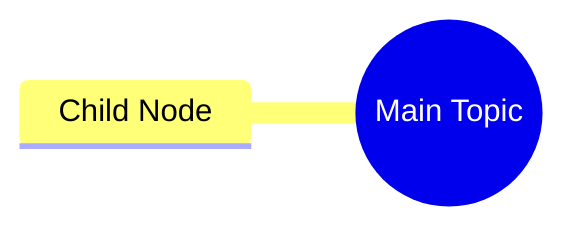

# Node Notes - Ghi Chú Node

## Tổng Quan

Mỗi node trong mindmap có thể có một **note** (ghi chú) đính kèm. Note cho phép thêm context, chi tiết mà không làm rối title chính.

---

## 1. Cách Thêm Note

### Khi đang edit node:

1. Click vào node để mở editor
2. Nhấn `Alt + N` để focus vào ô Note
3. Nhập nội dung ghi chú
4. Nhấn `Alt + Enter` để lưu

### Phím tắt trong Note:

- `Alt + T` - Quay lại ô Title
- `Alt + Enter` - Lưu và đóng
- `Escape` - Hủy chỉnh sửa

---

## 2. Hiển Thị Note

- Node có note sẽ hiển thị **icon tin nhắn** 💬 ở góc trên phải
- Hover vào icon để xem preview nội dung note
- Click vào node để xem và chỉnh sửa note đầy đủ

---

## 3. Lưu Trữ Trong Mermaid

Notes được lưu trong comment sau mỗi node:

---

## 4. Use Cases

- **Giải thích thêm** - Chi tiết không cần hiển thị trực tiếp
- **Nguồn tham khảo** - Links, citations
- **Ghi nhớ cá nhân** - Tips, tricks
- **Context** - Tại sao node này quan trọng
